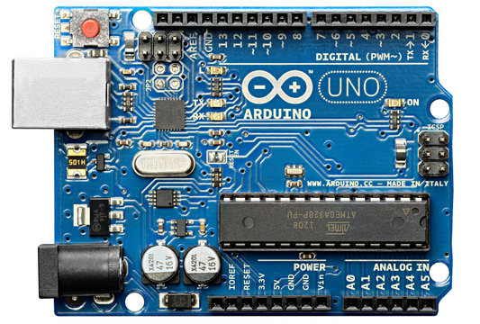
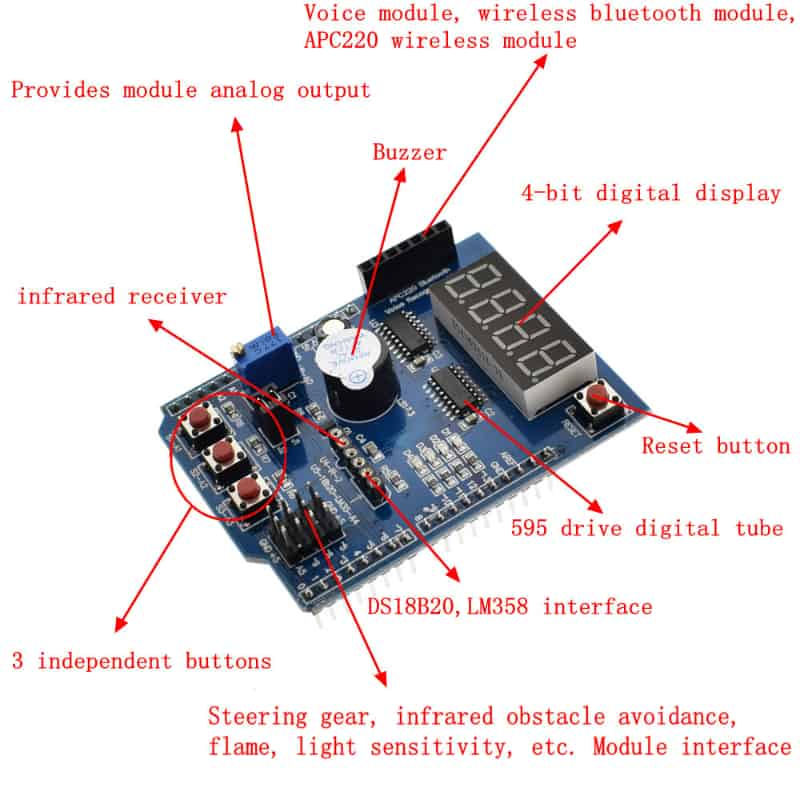
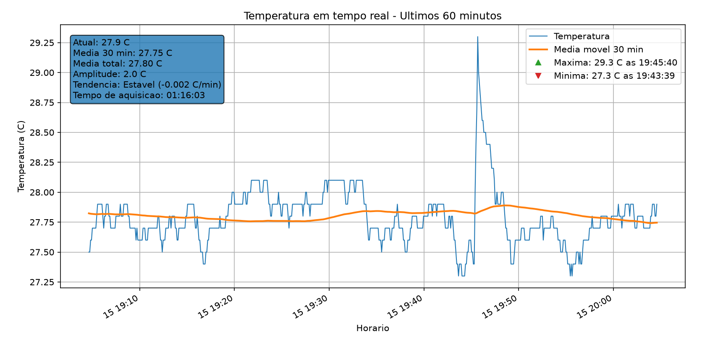
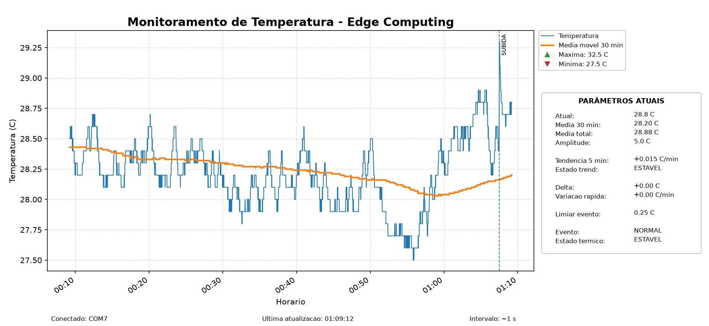

# Monitoramento de Temperatura — Experimento de Computação de Borda

## 1. Visão geral

Este projeto apresenta um experimento de aquisição, processamento, visualização e supervisão de temperatura utilizando um **Arduino Uno**, um **Multi Function Shield**, um sensor digital de temperatura **DS18B20** e uma aplicação desenvolvida em **Python**.

O desenvolvimento foi realizado de forma incremental e dividido em duas partes principais:

- **Parte 1 — Processamento centralizado:** o Arduino realiza a aquisição da temperatura e transmite os dados ao computador, onde são executados os cálculos, a análise e a visualização.
- **Parte 2 — Processamento na borda:** os principais cálculos e decisões passam a ser realizados no próprio Arduino, enquanto o Python assume principalmente as funções de supervisão, visualização e persistência.

Essa evolução permite comparar, em um mesmo experimento, uma arquitetura tradicional de aquisição com uma arquitetura baseada em **Edge Computing (Computação de Borda)**.

---

## 2. Objetivos

O experimento tem como objetivos:

- realizar a leitura de temperatura com o sensor DS18B20;
- utilizar o Arduino Uno como dispositivo de aquisição;
- transmitir medições e informações processadas pela comunicação serial;
- visualizar a temperatura em tempo real;
- calcular indicadores estatísticos;
- identificar tendências térmicas;
- detectar eventos rápidos de subida e queda de temperatura;
- registrar os dados coletados em arquivo CSV;
- migrar progressivamente o processamento do computador para o microcontrolador;
- desenvolver uma interface homem-máquina local no nó de borda;
- estudar autonomia, latência, processamento local e comunicação em sistemas de Edge Computing.

---

# Parte 1 — Processamento centralizado

## 3. Arquitetura inicial

Na primeira fase, o Arduino é responsável principalmente pela aquisição da temperatura. O processamento é realizado pelo computador.

```text
DS18B20
   |
   v
Arduino Uno
   |
   | USB / Serial
   v
Python
   |
   +-- Processamento
   +-- Visualização
   +-- Persistência
```

Nesta arquitetura, o Arduino envia os dados de temperatura e o computador executa os cálculos e a análise.

---

## 4. Hardware utilizado

O experimento utiliza:

- Arduino Uno;
- Multi Function Shield para Arduino;
- sensor de temperatura DS18B20;
- cabo USB com transmissão de dados;
- computador para aquisição, supervisão e armazenamento.

### Arduino Uno

<p align="center">
  
</p>

### Multi Function Shield

<p align="center">
  
</p>

O sensor DS18B20 é conectado ao Multi Function Shield utilizando a entrada correspondente ao pino **A4** do Arduino Uno.

---

## 5. Software utilizado

### Arduino

- Arduino IDE;
- biblioteca `MultiFuncShield`;
- biblioteca `OneWire`;
- biblioteca `DallasTemperature`;
- biblioteca `TimerOne`.

### Python

- Python;
- PySerial;
- Matplotlib;
- NumPy.

As dependências podem ser instaladas com:

```bash
python -m pip install pyserial matplotlib numpy
```

---

## 6. Aquisição da temperatura

O Arduino realiza a leitura do sensor DS18B20 e transmite os valores pela porta serial.

A comunicação é realizada a:

```text
9600 baud
```

As medições são atualizadas aproximadamente a cada:

```text
1 segundo
```

---

## 7. Monitoramento em Python

Na Parte 1, a aplicação Python recebe os dados brutos do Arduino e realiza os cálculos necessários ao monitoramento.

O gráfico apresenta uma janela móvel correspondente aos **últimos 60 minutos de aquisição**. Os dados mais antigos deixam de ser exibidos para que a visualização permaneça legível durante experimentos prolongados.

São apresentados:

- temperatura instantânea;
- média móvel de 30 minutos;
- média total;
- máxima;
- mínima;
- amplitude térmica;
- tendência térmica;
- tempo de aquisição.

---

## 8. Média móvel de 30 minutos

Na primeira implementação, a média móvel de 30 minutos é calculada no computador.

Durante os primeiros 30 minutos, são utilizadas todas as amostras disponíveis. Após esse período, a média passa a representar efetivamente os últimos 30 minutos.

---

## 9. Média total

A média total considera todo o período desde o início da aquisição.

Ela pode ser calculada sem manter todas as amostras em memória, utilizando:

```text
Média total = soma acumulada das temperaturas / número total de amostras
```

---

## 10. Máxima, mínima e amplitude térmica

Durante a execução são registradas as temperaturas máxima e mínima do experimento.

A amplitude térmica é calculada por:

```text
Amplitude = Temperatura máxima - Temperatura mínima
```

---

## 11. Tendência térmica

Na arquitetura centralizada, o Python calcula a tendência de variação da temperatura utilizando uma janela de aproximadamente 5 minutos.

O resultado é expresso em:

```text
°C/min
```

A tendência é classificada como:

```text
SUBINDO
CAINDO
ESTAVEL
```

---

## 12. Visualização da Parte 1

<p align="center">
  
</p>

<p align="center">
  <em>Figura 1 — Primeira fase do experimento, com processamento realizado predominantemente no computador.</em>
</p>

---

# Parte 2 — Processamento na borda

## 13. Migração do processamento para o Arduino

Na segunda fase, o Arduino deixa de atuar apenas como dispositivo de aquisição e passa a executar localmente os principais cálculos e decisões do sistema.

A arquitetura passa a ser:

```text
DS18B20
   |
   v
Arduino Uno / EDGE
   |
   +-- aquisição
   +-- média móvel
   +-- média total
   +-- máxima e mínima
   +-- amplitude
   +-- tendência
   +-- detecção de eventos
   +-- classificação térmica
   +-- interface local
   +-- alerta sonoro
   |
   | Serial
   v
Python
   |
   +-- supervisão
   +-- visualização
   +-- histórico de eventos
   +-- CSV
```

O computador passa a receber **informação já processada na borda**.

---

## 14. Limitações de memória e estratégia de agregação

O Arduino Uno possui apenas 2 kB de SRAM. Uma aquisição a cada segundo durante 30 minutos produziria:

```text
30 × 60 = 1.800 amostras
```

Se cada amostra fosse armazenada como um `float` de 4 bytes:

```text
1.800 × 4 = 7.200 bytes
```

Isso ultrapassa a memória disponível.

A solução adotada foi utilizar **agregações temporais por minuto**, organizadas em um buffer circular de 30 posições.

```text
leituras de 1 segundo
        |
        v
agregação por minuto
        |
        v
buffer circular de 30 minutos
        |
        v
média móvel de 30 minutos
```

Essa estratégia permite executar a média móvel diretamente no Arduino com baixo consumo de memória.

---

## 15. Média móvel de 30 minutos na borda

A média móvel de 30 minutos passou a ser calculada no Arduino.

O microcontrolador mantém, para cada minuto:

- soma das temperaturas;
- quantidade de amostras.

Quando o buffer circular avança, o minuto mais antigo é removido da janela e substituído pelas novas medições.

O Python apenas recebe o valor de `MEDIA30` já calculado.

---

## 16. Média total, máxima, mínima e amplitude na borda

O Arduino calcula continuamente:

```text
MEDIATOTAL
MAX
MIN
AMPL
```

A média total utiliza soma acumulada e contagem de amostras. Máxima e mínima são atualizadas a cada nova leitura e a amplitude é derivada diretamente desses valores.

---

## 17. Tendência térmica de 5 minutos

O Arduino calcula também uma tendência térmica de curto/médio prazo, expressa em:

```text
°C/min
```

A variável é transmitida como:

```text
TREND5
```

O comportamento é classificado como:

```text
SUBINDO
CAINDO
ESTAVEL
```

Durante os primeiros cinco minutos, enquanto ainda não há histórico suficiente para uma comparação completa, o sistema utiliza:

```text
AGUARDANDO
```

Isso evita classificar prematuramente a tendência como estável.

---

## 18. Detecção de eventos rápidos

O Arduino avalia a diferença entre leituras consecutivas:

```text
DELTA = temperatura atual - temperatura anterior
```

Também calcula uma taxa equivalente de variação rápida:

```text
RAPIDA = °C/min
```

O evento é classificado como:

```text
NORMAL
SUBIDA_RAPIDA
QUEDA_RAPIDA
```

A decisão é executada diretamente no microcontrolador.

---

## 19. Estado térmico

Além do evento instantâneo, o sistema combina a ocorrência rápida com a tendência de 5 minutos para produzir uma interpretação de mais alto nível.

Os estados possíveis são:

```text
SUBIDA_RAPIDA
QUEDA_RAPIDA
AQUECIMENTO
RESFRIAMENTO
ESTAVEL
```

Isso permite distinguir, por exemplo, uma subida rápida pontual de uma tendência sustentada de aquecimento.

---

## 20. Limiar ajustável de eventos rápidos

O limiar de detecção deixou de ser um valor fixo no código.

O **trimpot do Multi Function Shield**, conectado ao pino analógico A0, passou a controlar a sensibilidade do detector.

A faixa de ajuste utilizada é aproximadamente:

```text
0,10 °C a 1,00 °C
```

Exemplo:

```text
limiar baixo  -> maior sensibilidade
limiar alto   -> menor sensibilidade
```

O Arduino realiza uma leitura inicial do trimpot durante o `setup()`. Assim, o sistema já inicia utilizando a posição física atual do controle, sem depender de um valor fixo anterior.

O valor é transmitido ao computador como:

```text
LIMIAR
```

---

## 21. Interface homem-máquina local

Uma evolução importante da Parte 2 foi a criação de uma **interface homem-máquina local** utilizando os recursos do próprio Multi Function Shield.

O objetivo é permitir que o nó de borda seja observado e configurado mesmo sem depender do computador.

### Botão S1 — seleção do display

Um toque curto em S1 alterna ciclicamente entre:

```text
TEMP -> MEDIA30 -> TREND5 -> TEMP ...
```

O display de quatro dígitos apresenta o valor correspondente ao modo selecionado.

### LEDs indicadores

Os LEDs funcionam como legenda do display:

```text
LED 1 -> temperatura instantânea
LED 2 -> média móvel de 30 minutos
LED 3 -> tendência de 5 minutos
```

Isso elimina a ambiguidade de interpretar um número isolado no display.

### Botão S2 — ajuste do limiar

Um pressionamento longo de S2 entra ou sai do modo de configuração do limiar.

No modo de ajuste:

- o display mostra o valor do limiar;
- o trimpot altera o limiar em tempo real;
- os quatro LEDs piscam simultaneamente para indicar que o sistema está em modo de configuração.

Ao sair, o display e os LEDs retornam ao modo anteriormente selecionado.

---

## 22. Alertas sonoros locais

O buzzer do Multi Function Shield passou a sinalizar eventos rápidos diretamente no hardware.

A codificação utilizada é:

```text
SUBIDA_RAPIDA -> 1 bip
QUEDA_RAPIDA  -> 2 bips
```

O alerta é produzido no próprio Arduino, portanto independe da aplicação Python.

Esse comportamento reforça a autonomia do nó de borda: o dispositivo não apenas mede e processa, mas também reage localmente a uma condição relevante.

---

## 23. Telemetria produzida pela borda

A comunicação serial passou a transportar uma mensagem estruturada contendo os resultados do processamento local.

Exemplo conceitual:

```text
TEMP:30.6,
MEDIA30:30.46,
MEDIATOTAL:30.46,
MAX:30.8,
MIN:29.0,
AMPL:1.8,
TREND5:0.148,
ESTADO_TREND:SUBINDO,
DELTA:0.00,
RAPIDA:0.00,
EVENTO:NORMAL,
ESTADO_TERMICO:AQUECIMENTO,
LIMIAR:0.25
```

O computador deixa de receber somente um dado bruto e passa a receber **informação interpretada na borda**.

---

## 24. Nova função da aplicação Python

Na Parte 2, o Python assume principalmente o papel de supervisório.

Suas funções principais são:

- receber a telemetria produzida pelo Arduino;
- exibir temperatura e média móvel em tempo real;
- apresentar os indicadores atuais;
- registrar eventos históricos;
- armazenar os dados em CSV.

Os principais cálculos deixaram de ser refeitos no computador.

---

## 25. Painel de supervisão

O painel gráfico apresenta:

- temperatura atual;
- média móvel de 30 minutos;
- média total;
- máxima;
- mínima;
- amplitude;
- tendência de 5 minutos;
- estado da tendência;
- delta entre leituras;
- variação rápida;
- limiar de evento configurado no trimpot;
- evento atual;
- estado térmico;
- porta serial utilizada;
- horário da última atualização;
- intervalo aproximado de aquisição.

A legenda e o painel lateral permitem separar claramente dados instantâneos, indicadores calculados e estados produzidos pelo sistema de borda.

### Visualização do sistema na segunda etapa

A figura a seguir apresenta o supervisório Python após a migração do
processamento para o Arduino.

<p align="center">
  
</p>

<p align="center">
  <em>
  Figura 2 — Supervisório do sistema de Edge Computing, apresentando
  temperatura instantânea, média móvel de 30 minutos, parâmetros
  calculados pelo Arduino, limiar configurável de detecção e indicação
  temporal de eventos rápidos.
  </em>
</p>

---

## 26. Registro histórico dos eventos no gráfico

Quando o Arduino detecta:

```text
SUBIDA_RAPIDA
```

ou:

```text
QUEDA_RAPIDA
```

o Python registra o instante da ocorrência e mantém uma marca visual no gráfico.

Os eventos são apresentados com linhas verticais e os rótulos:

```text
SUBIDA
QUEDA
```

Assim, mesmo depois que o campo `EVENTO` retorna para `NORMAL`, a ocorrência continua visível no histórico da janela de 60 minutos.

---

## 27. Persistência em arquivo CSV

A persistência de dados foi efetivamente implementada na Parte 2.

A cada sessão, o Python cria automaticamente um arquivo com nome semelhante a:

```text
edge_temperatura_20260817_075000.csv
```

### Dados registrados no arquivo CSV

Cada linha do arquivo CSV corresponde a uma leitura recebida do Arduino
e contém tanto a temperatura medida quanto os indicadores calculados
localmente pelo nó de borda.

| Campo | Descrição |
|---|---|
| **Data** | Data em que a amostra foi recebida e registrada pelo computador. |
| **Hora** | Horário correspondente à aquisição da amostra. |
| **Temperatura** | Temperatura instantânea medida pelo sensor DS18B20, em °C. |
| **Media 30 min** | Média móvel da temperatura considerando a janela de até 30 minutos, calculada localmente pelo Arduino. |
| **Media total** | Média de todas as temperaturas registradas desde o início da sessão de aquisição. |
| **Maxima** | Maior temperatura observada desde o início da sessão. |
| **Minima** | Menor temperatura observada desde o início da sessão. |
| **Amplitude** | Diferença entre as temperaturas máxima e mínima registradas na sessão. |
| **Trend5** | Tendência térmica calculada utilizando uma janela aproximada de 5 minutos, expressa em °C/min. Valores positivos indicam aquecimento e valores negativos indicam resfriamento. |
| **Estado trend** | Classificação qualitativa da tendência de 5 minutos: `AGUARDANDO`, `SUBINDO`, `CAINDO` ou `ESTAVEL`. |
| **Delta** | Diferença de temperatura entre a leitura atual e a leitura imediatamente anterior, em °C. |
| **Variacao rapida** | Taxa de variação calculada a partir do `Delta` e do intervalo real entre as duas últimas leituras, expressa em °C/min. |
| **Limiar evento** | Valor de sensibilidade utilizado pelo Arduino para decidir se uma alteração deve ser classificada como evento rápido. Esse valor é ajustável pelo trimpot do Multi Function Shield. |
| **Evento** | Classificação da ocorrência instantânea: `NORMAL`, `SUBIDA_RAPIDA` ou `QUEDA_RAPIDA`. |
| **Estado termico** | Estado térmico global determinado pelo Arduino combinando eventos rápidos e tendência: `SUBIDA_RAPIDA`, `QUEDA_RAPIDA`, `AQUECIMENTO`, `RESFRIAMENTO` ou `ESTAVEL`. |```

O registro do limiar é especialmente útil porque permite saber qual sensibilidade estava configurada no instante em que determinado evento ocorreu.

A presença desses campos no arquivo CSV permite reconstruir não apenas
a evolução da temperatura, mas também as decisões tomadas pelo
dispositivo de borda ao longo do experimento. Por exemplo, é possível
identificar qual era o limiar de sensibilidade configurado no instante
em que determinado evento rápido foi detectado, bem como o estado
térmico e a tendência calculados naquele momento.

---

## 28. Redução da latência entre Arduino e Python

Durante os testes foi observado um atraso progressivo entre a ocorrência de um evento no Arduino e sua representação no gráfico.

O Arduino sinalizava imediatamente o evento pelo buzzer, enquanto o Python podia apresentar vários segundos de atraso.

A causa identificada foi o acúmulo de mensagens no buffer serial: a aplicação consumia apenas uma linha a cada atualização gráfica.

A lógica foi modificada para:

```text
ler todas as linhas disponíveis
        |
        +-- registrar todas no CSV
        +-- preservar todos os eventos
        |
        v
usar o estado mais recente para atualizar a tela
```

Após a alteração, o gráfico passou a responder praticamente em sincronismo com o evento detectado no Arduino.

---

## 29. Autonomia do nó de borda

A Parte 2 demonstra que o Arduino é capaz de operar como um pequeno nó de Edge Computing.

### Capacidades executadas localmente pelo nó de borda

O Arduino Uno passou a executar localmente diversas funções que, na
primeira etapa do experimento, dependiam do computador. As principais
capacidades implementadas são apresentadas a seguir.

| Capacidade | Descrição |
|---|---|
| **Aquisição** | Realiza a leitura periódica da temperatura fornecida pelo sensor DS18B20. Essa é a etapa de entrada dos dados no sistema. |
| **Processamento** | Executa localmente os cálculos necessários para transformar a temperatura medida em informações mais úteis, reduzindo a dependência do computador. |
| **Agregação** | Organiza e resume as medições ao longo do tempo, como no cálculo da média móvel de 30 minutos por meio de agregações temporais. |
| **Classificação** | Interpreta o comportamento térmico e atribui estados qualitativos, como `SUBINDO`, `CAINDO`, `ESTAVEL`, `AQUECIMENTO` ou `RESFRIAMENTO`. |
| **Ajuste de sensibilidade** | Permite ao operador modificar localmente o limiar utilizado na detecção de eventos rápidos. O ajuste é realizado pelo trimpot do Multi Function Shield e visualizado no display. |
| **Detecção de eventos** | Identifica alterações térmicas consideradas relevantes, classificando-as como `SUBIDA_RAPIDA`, `QUEDA_RAPIDA` ou `NORMAL`, de acordo com o limiar configurado. |
| **Feedback visual** | Utiliza o display e os LEDs do Multi Function Shield para apresentar valores, indicar o modo de visualização selecionado e sinalizar o modo de configuração. |
| **Alerta sonoro** | Utiliza o buzzer do shield para fornecer uma indicação imediata de eventos rápidos: um bip para `SUBIDA_RAPIDA` e dois bips para `QUEDA_RAPIDA`. |
| **Interação com o operador** | Permite o controle local do sistema por meio dos botões, LEDs, display e trimpot, possibilitando alternar informações exibidas e configurar parâmetros sem depender do computador. |

O computador deixa de participar diretamente da tomada de decisão e passa a atuar como supervisório e repositório dos dados.
A implementação dessas funções demonstra a evolução do Arduino de um
simples dispositivo de aquisição para um nó de borda com capacidade de
processamento, decisão e interação local. O sistema pode interpretar os
dados do sensor, identificar situações relevantes e fornecer respostas
visuais e sonoras mesmo sem a participação direta do computador.

## 30. Comparação das duas arquiteturas

O experimento foi desenvolvido em duas etapas principais, permitindo
observar na prática a diferença entre uma arquitetura de aquisição com
**processamento centralizado** e uma arquitetura baseada em
**computação de borda**.

Embora o hardware de aquisição permaneça essencialmente o mesmo, a
principal diferença entre as duas etapas está no local em que os dados
são processados e transformados em informação.

### Parte 1 — Processamento centralizado

Na primeira etapa do experimento, o Arduino Uno desempenhava
principalmente a função de dispositivo de aquisição.

O sensor DS18B20 realizava a medição da temperatura e o Arduino
transmitia os valores obtidos através da comunicação serial para o
computador.

A arquitetura podia ser representada da seguinte forma:

```text
DS18B20
   |
   | temperatura medida
   v
Arduino Uno
   |
   | dados de temperatura
   | USB / Serial
   v
Computador / Python
   |
   +-- média móvel de 30 minutos
   +-- média total
   +-- temperatura máxima
   +-- temperatura mínima
   +-- amplitude térmica
   +-- análise de tendência
   +-- classificação do comportamento
   +-- visualização gráfica
   +-- armazenamento dos dados
```

Nessa arquitetura, o Arduino tinha pouca participação na interpretação
dos dados. Sua principal responsabilidade era adquirir a temperatura e
transmiti-la.

O computador recebia as amostras e realizava praticamente todo o
processamento necessário para produzir informações de nível mais alto.

Por exemplo, uma medição como:

```text
Temperatura: 29.8 °C
```

era apenas um dado bruto enviado pelo Arduino.

Somente depois de chegar ao computador esse dado era combinado com as
demais amostras para produzir informações como:

```text
Média de 30 minutos
Média total
Máxima
Mínima
Amplitude
Tendência térmica
Estado da tendência
```

Assim, a interpretação do comportamento térmico dependia diretamente
da aplicação Python.

Caso o computador fosse desconectado, o Arduino ainda poderia realizar
a leitura da temperatura, porém grande parte da capacidade de análise
do sistema deixaria de estar disponível.

Essa característica representa uma arquitetura predominantemente
centralizada:

```text
AQUISIÇÃO                     PROCESSAMENTO

Sensor                          Computador
  |                                 ^
  v                                 |
Arduino ----------------------------+
            dados brutos
```

O fluxo de informação da Parte 1 pode ser resumido por:

```text
MEDIR
  |
  v
TRANSMITIR
  |
  v
PROCESSAR NO COMPUTADOR
  |
  v
INTERPRETAR
  |
  v
VISUALIZAR
```

---

### Parte 2 — Processamento na borda

Na segunda etapa, a arquitetura foi modificada de forma significativa.

O Arduino deixou de atuar apenas como dispositivo de aquisição e passou
a executar localmente uma parte relevante do processamento, da análise
e da tomada de decisão.

A nova arquitetura pode ser representada da seguinte forma:

```text
DS18B20
   |
   | temperatura
   v
Arduino Uno / Nó de Borda
   |
   +-- aquisição
   +-- média móvel de 30 minutos
   +-- média total
   +-- máxima
   +-- mínima
   +-- amplitude
   +-- tendência de 5 minutos
   +-- cálculo do Delta
   +-- cálculo da variação rápida
   +-- classificação da tendência
   +-- detecção de eventos
   +-- determinação do estado térmico
   +-- ajuste local de sensibilidade
   +-- interface com o operador
   +-- alerta sonoro
   |
   | informação já processada
   | USB / Serial
   v
Computador / Python
   |
   +-- supervisão
   +-- visualização gráfica
   +-- histórico de eventos
   +-- registro em CSV
```

A principal diferença está no conteúdo transmitido pelo Arduino.

Na Parte 1, o computador recebia essencialmente a temperatura e precisava
interpretá-la.

Na Parte 2, o Arduino transmite não apenas a temperatura medida, mas
também diversos indicadores calculados localmente.

Uma mensagem serial pode conter, por exemplo:

```text
TEMP:30.2,
MEDIA30:29.87,
MEDIATOTAL:29.74,
MAX:31.1,
MIN:28.9,
AMPL:2.2,
TREND5:0.083,
ESTADO_TREND:SUBINDO,
DELTA:0.06,
RAPIDA:2.14,
EVENTO:NORMAL,
ESTADO_TERMICO:AQUECIMENTO,
LIMIAR:0.25
```

Portanto, o computador já recebe não apenas o valor medido pelo sensor,
mas também informações derivadas e classificações produzidas
localmente.

A transformação realizada na borda pode ser representada por:

```text
DADO
 |
 | 30.2 °C
 v
PROCESSAMENTO LOCAL
 |
 +--> média
 +--> tendência
 +--> Delta
 +--> variação rápida
 +--> evento
 +--> estado térmico
 |
 v
INFORMAÇÃO
```

Essa mudança representa um dos princípios fundamentais da computação de
borda: aproximar o processamento da origem dos dados.

---

### Mudança do papel do computador

Outra consequência importante da segunda arquitetura é a mudança do
papel da aplicação Python.

Na Parte 1:

```text
Python =
processamento
+ análise
+ visualização
+ armazenamento
```

Na Parte 2:

```text
Python =
supervisão
+ visualização
+ armazenamento
```

Grande parte da inteligência necessária para interpretar o fenômeno
térmico passa a estar no próprio dispositivo de borda.

O gráfico Python, portanto, deixa de ser o elemento responsável por
decidir se a temperatura está subindo rapidamente, se existe uma
tendência de aquecimento ou se ocorreu um evento relevante.

Essas decisões já foram tomadas pelo Arduino.

O Python passa a apresentar ao operador os resultados dessas decisões e
a manter o histórico de funcionamento do sistema.

---

### Processamento em diferentes escalas de tempo

A segunda arquitetura também passou a trabalhar com diferentes escalas
temporais de análise.

```text
Leitura instantânea
       |
       v
Delta entre amostras
       |
       v
Detecção de evento rápido
```

Paralelamente:

```text
Amostras
   |
   v
Agregação temporal
   |
   v
Tendência de aproximadamente 5 minutos
   |
   v
Classificação térmica
```

E, em uma escala ainda maior:

```text
Amostras
   |
   v
Agregações de 1 minuto
   |
   v
Janela móvel de 30 minutos
   |
   v
Média móvel
```

Dessa maneira, o nó de borda consegue observar tanto alterações rápidas
quanto comportamentos térmicos mais lentos.

---

### Autonomia local

Uma consequência especialmente importante da migração do processamento
é o aumento da autonomia do sistema.

Na arquitetura centralizada, diversas informações somente estavam
disponíveis enquanto o computador executava o programa Python.

Na arquitetura de borda, o Arduino consegue continuar adquirindo,
processando e interpretando os dados localmente mesmo sem a aplicação
de supervisão.

O nó de borda possui:

```text
Sensor
  +
Processamento
  +
Display
  +
LEDs
  +
Teclado
  +
Trimpot
  +
Buzzer
```

Isso permite que o sistema execute localmente a seguinte sequência:

```text
MEDIR
  |
  v
PROCESSAR
  |
  v
INTERPRETAR
  |
  v
CLASSIFICAR
  |
  v
DETECTAR EVENTOS
  |
  v
ALERTAR
  |
  v
INTERAGIR COM O OPERADOR
```

O computador deixa, portanto, de ser indispensável para várias das
funções básicas de análise e operação.

---

### Resposta local a eventos

Um exemplo importante dessa autonomia é a detecção de variações rápidas
de temperatura.

Quando o Arduino identifica uma alteração que ultrapassa o limiar
configurado, a decisão é tomada localmente.

Uma subida rápida pode produzir:

```text
SUBIDA_RAPIDA
      |
      +--> classificação local
      |
      +--> 1 bip no buzzer
      |
      +--> transmissão do evento
      |
      +--> marcador no gráfico Python
      |
      +--> registro no CSV
```

Da mesma forma:

```text
QUEDA_RAPIDA
      |
      +--> classificação local
      |
      +--> 2 bips no buzzer
      |
      +--> transmissão do evento
      |
      +--> marcador no gráfico Python
      |
      +--> registro no CSV
```

O alerta sonoro ocorre diretamente no dispositivo de borda.

Isso significa que a resposta ao evento não depende do tempo necessário
para transmitir os dados, processá-los no computador e atualizar a
interface gráfica.

---

### Interação local com o operador

A segunda arquitetura introduziu também uma interface homem-máquina
local utilizando os recursos do Multi Function Shield.

Essa interface permite que o operador consulte informações e altere
parâmetros sem utilizar o computador.

#### Botão S1

O botão S1 é utilizado para navegar entre as informações apresentadas
no display.

Cada toque curto altera a variável exibida:

```text
TEMP
 |
 | S1
 v
MEDIA30
 |
 | S1
 v
TREND5
 |
 | S1
 v
TEMP
```

Os LEDs funcionam como indicadores do conteúdo apresentado no display:

```text
LED 1 aceso → Temperatura instantânea
LED 2 aceso → Média móvel de 30 minutos
LED 3 aceso → Tendência de 5 minutos
```

Essa sinalização é importante porque o display apresenta valores
numéricos e, sem uma indicação auxiliar, diferentes grandezas poderiam
ser confundidas.

---

### Botão S2 e modo de configuração

O botão S2 é utilizado para acessar o modo de configuração do limiar de
detecção de eventos rápidos.

Para evitar acionamentos acidentais, o sistema utiliza um
**pressionamento longo** de S2.

O funcionamento é:

```text
Modo normal
    |
    | S2 pressionado por aproximadamente 1 segundo
    | e depois liberado
    v
Modo de ajuste
```

Durante o modo de ajuste:

```text
4 LEDs piscando
       |
       v
Display mostra o limiar
       |
       v
Trimpot altera o valor
```

Um novo pressionamento longo em S2 encerra a configuração:

```text
Modo de ajuste
    |
    | S2 longo
    v
Modo normal
```

Ao sair do modo de ajuste, o display retorna à variável que estava
selecionada anteriormente.

---

### Ajuste de sensibilidade pelo trimpot

O trimpot do Multi Function Shield foi incorporado à interface do
sistema como controle de sensibilidade.

O valor analógico é convertido para um limiar aproximadamente entre:

```text
0.10 °C e 1.00 °C
```

Esse limiar determina a magnitude mínima de alteração necessária para
que o Arduino classifique uma variação como evento rápido.

Exemplo:

```text
Limiar = 0.25 °C

Delta = +0.10 °C
        |
        v
      NORMAL
```

Enquanto:

```text
Limiar = 0.25 °C

Delta = +0.31 °C
        |
        v
SUBIDA_RAPIDA
```

Um limiar menor torna o sistema mais sensível.

Um limiar maior reduz a sensibilidade e exige uma alteração mais intensa
para que um evento seja detectado.

A posição do trimpot é lida também durante a inicialização do Arduino.

Dessa maneira, o sistema inicia utilizando imediatamente o valor físico
configurado pelo operador, sem depender de um valor fixo previamente
programado.

---

### Feedback visual e sonoro

A interface local utiliza diferentes recursos para transmitir
informações ao operador.

```text
DISPLAY
   |
   +--> temperatura
   +--> média de 30 minutos
   +--> tendência
   +--> limiar durante configuração
```

```text
LEDS
   |
   +--> identificação da variável exibida
   +--> indicação do modo de configuração
```

```text
BUZZER
   |
   +--> 1 bip = SUBIDA_RAPIDA
   +--> 2 bips = QUEDA_RAPIDA
```

Essa combinação cria uma interface simples, porém suficiente para
permitir operação local do nó de borda.

---

### Supervisão no computador

Embora o Arduino tenha adquirido maior autonomia, o computador continua
desempenhando um papel importante.

O Python recebe as informações processadas e apresenta:

```text
Temperatura atual
Média móvel de 30 minutos
Média total
Máxima
Mínima
Amplitude
Tendência de 5 minutos
Estado da tendência
Delta
Variação rápida
Limiar de evento
Evento atual
Estado térmico
```

Os eventos rápidos também são mantidos no gráfico através de linhas
verticais identificadas como:

```text
SUBIDA
```

ou:

```text
QUEDA
```

Assim, mesmo depois de o evento atual retornar para `NORMAL`, permanece
um registro visual do instante em que a ocorrência foi detectada.

---

### Persistência das informações

Na segunda arquitetura, os dados recebidos pelo computador também são
registrados automaticamente em arquivo CSV.

O arquivo passa a armazenar não apenas medições de temperatura, mas
também os indicadores calculados pelo dispositivo de borda.

Isso permite reconstruir posteriormente:

```text
o valor medido
+
o estado do sistema
+
o limiar configurado
+
a tendência
+
os eventos detectados
+
a classificação térmica
```

Dessa forma, o arquivo representa não apenas um histórico das medições,
mas também um histórico das decisões tomadas pelo nó de borda.

---

### Sincronização entre a borda e o supervisório

Durante o desenvolvimento foi identificado um atraso progressivo entre
os eventos detectados pelo Arduino e sua representação no gráfico.

O problema estava relacionado ao acúmulo de mensagens no buffer serial
do computador.

Inicialmente, o Python processava apenas uma linha serial antes de cada
redesenho do gráfico.

O fluxo era aproximadamente:

```text
Arduino
   |
   +--> mensagem 1
   +--> mensagem 2
   +--> mensagem 3
   +--> mensagem 4
             |
             v
       buffer serial
             |
             v
Python processava
uma mensagem por vez
```

Com o aumento do atraso, o computador podia estar apresentando uma
informação gerada vários segundos antes.

A lógica foi modificada para que o Python processe todas as mensagens
disponíveis no buffer antes de atualizar a tela.

A nova estratégia é:

```text
Buffer serial
      |
      v
Ler todas as mensagens disponíveis
      |
      +--> registrar todas no CSV
      |
      +--> registrar todos os eventos
      |
      v
Selecionar o estado mais recente
      |
      v
Atualizar o gráfico
```

Com essa modificação, o sinal sonoro produzido pelo Arduino e a
indicação correspondente no gráfico passaram a ocorrer de forma
praticamente sincronizada.

---

### Comparação resumida

| Característica | Parte 1 — Processamento centralizado | Parte 2 — Edge Computing |
|---|---|---|
| **Aquisição da temperatura** | Arduino | Arduino |
| **Processamento estatístico** | Computador | Arduino |
| **Média móvel de 30 minutos** | Python | Arduino |
| **Média total** | Python | Arduino |
| **Máxima e mínima** | Python | Arduino |
| **Amplitude térmica** | Python | Arduino |
| **Análise de tendência** | Python | Arduino |
| **Detecção de eventos rápidos** | Não implementada inicialmente na borda | Arduino |
| **Classificação da tendência** | Computador | Arduino |
| **Classificação do estado térmico** | Computador | Arduino |
| **Cálculo do Delta** | Computador | Arduino |
| **Cálculo da variação rápida** | Computador | Arduino |
| **Ajuste de sensibilidade** | Não disponível localmente | Trimpot do Multi Function Shield |
| **Interface local** | Limitada | Display, LEDs, botões e trimpot |
| **Seleção da informação no display** | Não aplicável | Botão S1 |
| **Modo de configuração** | Não disponível | Botão S2 |
| **Indicação visual do modo** | Não disponível | LEDs |
| **Alerta sonoro** | Não disponível | Buzzer |
| **Visualização gráfica** | Python | Python |
| **Registro em CSV** | Computador | Computador |
| **Histórico gráfico de eventos** | Não disponível | Python |
| **Funcionamento analítico sem computador** | Limitado | Parcialmente autônomo |
| **Informação transmitida** | Principalmente dados medidos | Dados, indicadores e decisões |
| **Papel principal do computador** | Processamento e supervisão | Supervisão e armazenamento |

---

### Síntese da evolução

A arquitetura da primeira etapa pode ser resumida por:

```text
PARTE 1

Sensor
   |
   v
Arduino
   |
   v
DADOS
   |
   v
Computador
   |
   v
PROCESSAMENTO
   |
   v
INFORMAÇÃO
```

Na segunda etapa:

```text
PARTE 2

Sensor
   |
   v
Arduino / EDGE
   |
   v
PROCESSAMENTO LOCAL
   |
   v
INFORMAÇÃO
   |
   v
Computador
   |
   v
SUPERVISÃO E REGISTRO
```

Assim, a principal transformação realizada no experimento não foi
apenas a transferência de alguns cálculos do Python para o Arduino.

Houve uma mudança na própria arquitetura do sistema.

O Arduino passou de um dispositivo predominantemente dedicado à
aquisição para um **nó de borda capaz de adquirir, processar, agregar,
classificar, detectar eventos, permitir ajustes de sensibilidade,
interagir com o operador e produzir respostas visuais e sonoras
localmente**.

O computador continua sendo importante, porém passa a exercer
principalmente o papel de supervisório, visualização histórica e
persistência das informações produzidas pelo dispositivo de borda.


## 30. Comparação das duas arquiteturas

O experimento foi desenvolvido em duas etapas principais, permitindo
observar na prática a diferença entre uma arquitetura de aquisição com
**processamento centralizado** e uma arquitetura baseada em
**computação de borda**.

Embora o hardware de aquisição permaneça essencialmente o mesmo, a
principal diferença entre as duas etapas está no local em que os dados
são processados e transformados em informação.

### Parte 1 — Processamento centralizado

Na primeira etapa do experimento, o Arduino Uno desempenhava
principalmente a função de dispositivo de aquisição.

O sensor DS18B20 realizava a medição da temperatura e o Arduino
transmitia os valores obtidos através da comunicação serial para o
computador.

A arquitetura podia ser representada da seguinte forma:

```text
DS18B20
   |
   | temperatura medida
   v
Arduino Uno
   |
   | dados de temperatura
   | USB / Serial
   v
Computador / Python
   |
   +-- média móvel de 30 minutos
   +-- média total
   +-- temperatura máxima
   +-- temperatura mínima
   +-- amplitude térmica
   +-- análise de tendência
   +-- classificação do comportamento
   +-- visualização gráfica
   +-- armazenamento dos dados
```
Nessa arquitetura, o Arduino tinha pouca participação na interpretação
dos dados. Sua principal responsabilidade era adquirir a temperatura e
transmiti-la.

O computador recebia as amostras e realizava praticamente todo o
processamento necessário para produzir informações de nível mais alto.

Por exemplo, uma medição como Temperatura: 29.8 °C era apenas um dado bruto enviado pelo Arduino.
Somente depois de chegar ao computador esse dado era combinado com as
demais amostras para produzir informações como:

Média de 30 minutos
Média total
Máxima
Mínima
Amplitude
Tendência térmica
Estado da tendência

Assim, a interpretação do comportamento térmico dependia diretamente
da aplicação Python.

Caso o computador fosse desconectado, o Arduino ainda poderia realizar
a leitura da temperatura, porém grande parte da capacidade de análise
do sistema deixaria de estar disponível.

Essa característica representa uma arquitetura predominantemente
centralizada:

```
AQUISIÇÃO                     PROCESSAMENTO

Sensor                          Computador
  |                                 ^
  v                                 |
Arduino ----------------------------+
            dados brutos
```
fluxo de informação da Parte 1 pode ser resumido por:

```
MEDIR
  |
  v
TRANSMITIR
  |
  v
PROCESSAR NO COMPUTADOR
  |
  v
INTERPRETAR
  |
  v
VISUALIZAR
```
### Parte 2 — Processamento na borda

Na segunda etapa, a arquitetura foi modificada de forma significativa.
O Arduino deixou de atuar apenas como dispositivo de aquisição e passou
a executar localmente uma parte relevante do processamento, da análise
e da tomada de decisão.
A nova arquitetura pode ser representada da seguinte forma:

```
DS18B20
   |
   | temperatura
   v
Arduino Uno / Nó de Borda
   |
   +-- aquisição
   +-- média móvel de 30 minutos
   +-- média total
   +-- máxima
   +-- mínima
   +-- amplitude
   +-- tendência de 5 minutos
   +-- cálculo do Delta
   +-- cálculo da variação rápida
   +-- classificação da tendência
   +-- detecção de eventos
   +-- determinação do estado térmico
   +-- ajuste local de sensibilidade
   +-- interface com o operador
   +-- alerta sonoro
   |
   | informação já processada
   | USB / Serial
   v
Computador / Python
   |
   +-- supervisão
   +-- visualização gráfica
   +-- histórico de eventos
   +-- registro em CSV
```

A principal diferença está no conteúdo transmitido pelo Arduino.
Na Parte 1, o computador recebia essencialmente a temperatura e precisava
interpretá-la.
Na Parte 2, o Arduino transmite não apenas a temperatura medida, mas
também diversos indicadores calculados localmente.
Uma mensagem serial pode conter, por exemplo:

```
TEMP:30.2,
MEDIA30:29.87,
MEDIATOTAL:29.74,
MAX:31.1,
MIN:28.9,
AMPL:2.2,
TREND5:0.083,
ESTADO_TREND:SUBINDO,
DELTA:0.06,
RAPIDA:2.14,
EVENTO:NORMAL,
ESTADO_TERMICO:AQUECIMENTO,
LIMIAR:0.25
```
Portanto, o computador já recebe não apenas o valor medido pelo sensor,
mas também informações derivadas e classificações produzidas
localmente.
A transformação realizada na borda pode ser representada por:

```
DADO
 |
 | 30.2 °C
 v
PROCESSAMENTO LOCAL
 |
 +--> média
 +--> tendência
 +--> Delta
 +--> variação rápida
 +--> evento
 +--> estado térmico
 |
 v
INFORMAÇÃO

```
Essa mudança representa um dos princípios fundamentais da computação de
borda: aproximar o processamento da origem dos dados.

### Mudança do papel do computador

Outra consequência importante da segunda arquitetura é a mudança do
papel da aplicação Python.

Na Parte 1:

```
Python =
processamento
+ análise
+ visualização
+ armazenamento
```
Na Parte 2:

```
Python =
supervisão
+ visualização
+ armazenamento
```
Grande parte da inteligência necessária para interpretar o fenômeno
térmico passa a estar no próprio dispositivo de borda.
O gráfico Python, portanto, deixa de ser o elemento responsável por
decidir se a temperatura está subindo rapidamente, se existe uma
tendência de aquecimento ou se ocorreu um evento relevante.
Essas decisões já foram tomadas pelo Arduino.
O Python passa a apresentar ao operador os resultados dessas decisões e
a manter o histórico de funcionamento do sistema.

### Processamento em diferentes escalas de tempo

A segunda arquitetura também passou a trabalhar com diferentes escalas
temporais de análise.

```
Leitura instantânea
       |
       v
Delta entre amostras
       |
       v
Detecção de evento rápido
```
Paralelamente:

```
Amostras
   |
   v
Agregação temporal
   |
   v
Tendência de aproximadamente 5 minutos
   |
   v
Classificação térmica
```
E, em uma escala ainda maior:
```
Amostras
   |
   v
Agregações de 1 minuto
   |
   v
Janela móvel de 30 minutos
   |
   v
Média móvel
```
Dessa maneira, o nó de borda consegue observar tanto alterações rápidas
quanto comportamentos térmicos mais lentos.

### Autonomia local

Uma consequência especialmente importante da migração do processamento
é o aumento da autonomia do sistema.
Na arquitetura centralizada, diversas informações somente estavam
disponíveis enquanto o computador executava o programa Python.
Na arquitetura de borda, o Arduino consegue continuar adquirindo,
processando e interpretando os dados localmente mesmo sem a aplicação
de supervisão.
O nó de borda possui:

```
Sensor
  +
Processamento
  +
Display
  +
LEDs
  +
Teclado
  +
Trimpot
  +
Buzzer
```
Isso permite que o sistema execute localmente a seguinte sequência:

```
MEDIR
  |
  v
PROCESSAR
  |
  v
INTERPRETAR
  |
  v
CLASSIFICAR
  |
  v
DETECTAR EVENTOS
  |
  v
ALERTAR
  |
  v
INTERAGIR COM O OPERADOR
```
O computador deixa, portanto, de ser indispensável para várias das
funções básicas de análise e operação.

### Resposta local a eventos

Um exemplo importante dessa autonomia é a detecção de variações rápidas
de temperatura.
Quando o Arduino identifica uma alteração que ultrapassa o limiar
configurado, a decisão é tomada localmente.
Uma subida rápida pode produzir:

```
SUBIDA_RAPIDA
      |
      +--> classificação local
      |
      +--> 1 bip no buzzer
      |
      +--> transmissão do evento
      |
      +--> marcador no gráfico Python
      |
      +--> registro no CSV
```
Da mesma forma:

```
QUEDA_RAPIDA
      |
      +--> classificação local
      |
      +--> 2 bips no buzzer
      |
      +--> transmissão do evento
      |
      +--> marcador no gráfico Python
      |
      +--> registro no CSV
```
O alerta sonoro ocorre diretamente no dispositivo de borda.

Isso significa que a resposta ao evento não depende do tempo necessário
para transmitir os dados, processá-los no computador e atualizar a
interface gráfica.

### Interação local com o operador

A segunda arquitetura introduziu também uma interface homem-máquina
local utilizando os recursos do Multi Function Shield.

Essa interface permite que o operador consulte informações e altere
parâmetros sem utilizar o computador.

Botão S1

O botão S1 é utilizado para navegar entre as informações apresentadas
no display.

Cada toque curto altera a variável exibida:


## 31. Próximas etapas

As próximas evoluções possíveis incluem:

- comunicação sem fio utilizando ESP32;
- uso do ESP32 como gateway entre Arduino e rede Wi-Fi;
- comunicação TCP/IP;
- utilização de MQTT;
- dashboards acessíveis pela rede;
- integração com banco de dados;
- utilização de múltiplos nós de borda;
- comparação quantitativa entre comunicação serial e comunicação em rede;
- avaliação de latência e volume de dados transmitidos;
- eventual migração integral da aplicação para o ESP32.

Uma possível arquitetura futura é:

```text
DS18B20
   |
   v
Arduino / EDGE
   |
   | UART
   v
ESP32 / Gateway
   |
   | Wi-Fi
   v
Rede
   |
   +-- Python
   +-- MQTT
   +-- Dashboard
   +-- Banco de dados
```

---

## 32. Objetivo acadêmico

O experimento busca demonstrar de forma prática e incremental a evolução de um sistema tradicional de aquisição de dados para uma arquitetura baseada em **Computação de Borda**.

A temperatura foi escolhida como variável experimental por permitir uma implementação simples, observável e controlável. Entretanto, os conceitos desenvolvidos podem ser aplicados a sistemas com múltiplos sensores, Internet das Coisas, monitoramento ambiental, automação, sistemas distribuídos e aplicações industriais.

A Parte 2 é especialmente relevante porque demonstra que o nó de borda pode não apenas adquirir dados, mas também **processar, interpretar, decidir, sinalizar e interagir localmente com o operador**.

---

## Autor

**Charles Cavalcante Alcarde**

Projeto desenvolvido no contexto de estudos e experimentos em **Computação de Borda (Edge Computing)**.

2026
